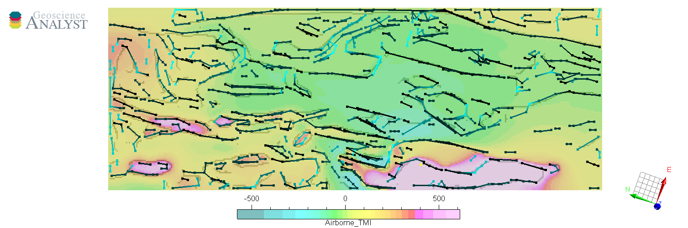
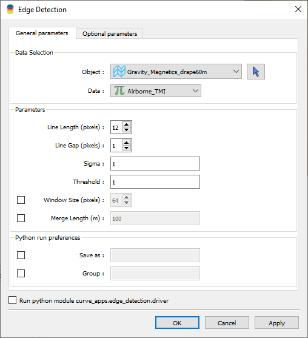
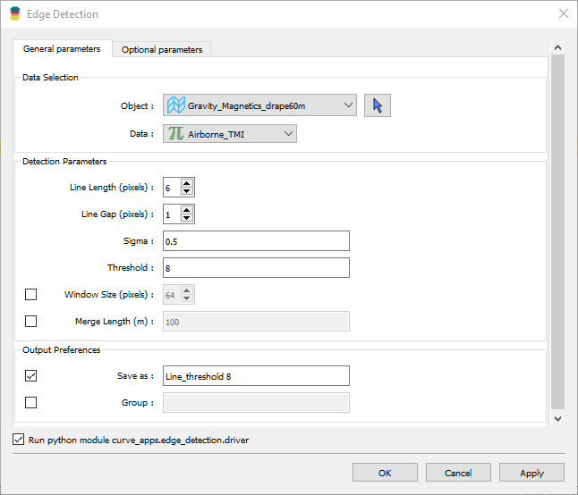

.. _edge_detection:

Edge Detection
==============

With this application, users can create lineaments (line segments)
from gridded data in a semi-automated fashion. The application uses
machine vision algorithms from the
`Scikit-Image <https://scikit-image.org/>`__ open-source package. Edges are exported to `Geoscience ANALYST <https://mirageoscience.com/mining-industry-software/geoscience-analyst/>`__
for viewing and editing.

New user? Visit the `Getting Started <getting_started>`_ page.

Application
-----------

The following sections provide details on the different parameters exposed in the user-interface (``edge_detection.ui.json``).

Data Selection
^^^^^^^^^^^^^^

 - **Object**: Select the target ``Grid2D`` object from the dropdown list.
 - **Data**: Select the data attribute to use for edge detection.

Detection Parameters
^^^^^^^^^^^^^^^^^^^^

List of parameters controlling the detection and filtering of lineaments.

 - `Scikit-Image.feature.Canny <https://scikit-image.org/docs/dev/auto_examples/edges/plot_canny.html#sphx-glr-auto-examples-edges-plot-canny-py>`__
    - **Sigma**: Standard deviation of the Gaussian filter used to smooth the input data. Increase the parameter to detect fewer edges in noisy data.

 - `Scikit-Image.transform.probabilistic_hough_line <https://scikit-image.org/docs/dev/api/skimage.transform.html#probabilistic-hough-line>`__
    - **Line length**: Filter for the minimum length (pixels) of detected lines. Increase the parameter to extract longer lines.
    - **Line gap**: Maximum gap between pixels to still form a line. Increase the parameter to allow for longer edges over disconnected pixels.
    - **Threshold**: Threshold parameter used in the Hough Line Transform.

.. _optional_parameters:

 - Optionals
    - **Window size**: Size of the square window used to sub-divide the grid for processing. By default, the window size is set to the shortest side of the input grid. Smaller window sizes can be used to speed up computations but may result in more fragmented lines. Larger window sizes can be used to improve line continuity but may slow down computations.
    - **Merge length**: Merge neighboring vertices generated by the Hough line transform, within a specified distance (in meters). This parameter is useful for merging fragmented lines that are close to each other but not connected.

Output Preferences
^^^^^^^^^^^^^^^^^^

 - **Save as**: Assign a specific name to the resulting ``Curve`` object.
 - **Group**: Create a ``Container Group`` entity to store the results.

.. _edge_methodology:

Methodology
-----------

The conversion from raster data to line segments involves the following four
main processing steps.

.. figure:: ./images/edge_detection/edge_detection_algo.png
            :align: center
            :width: 500

1. The selected gridded data are normalized between [0, 1]

2. Normalized values are processed with the
   `Canny <https://scikit-image.org/docs/stable/auto_examples/edges/plot_canny.html>`__ detection algorithm to extract a binary edge map.

3. The full grid is sub-divided into overlapping **square tiles** defined by
   the `window size <optional_parameters>`_ parameter. Tiling is used to speed
   up computations but to also avoid skewing the detection of lines along the longest axis of the input grid.

4. For each tile, edges are converted to a line parametric form using
   the `Hough Line Transform <https://scikit-image.org/docs/dev/api/skimage.transform.html#probabilistic-hough-line>`__.

[Optional] The resulting vertices defining the segments can be filtered to reduce the number of unique lines. Collocated
vertices are merged if they are within a specified distance of each other. This is controlled by the `merge length <optional_parameters>`__ parameter.

The final output is a ``Curve`` object containing the detected line segments.
The orientation of the line segments, in absolute degree from North [-90, 90], and line length are stored as data on ``Curve.vertices``.

Example
-------

This section demonstrates the effect of various detection parameters on a training grid provided `here <https://github.com/MiraGeoscience/curve-apps/tree/main/edge_detection-assets>`__.
The goal is to extract the lineaments from gridded magnetic field data. We begin with default parameters and then explore the effect of changing each parameter independently.

.. list-table::
   :widths: 25 25
   :header-rows: 1

   * - Gridded magnetic data
     - Default parameters

   * - .. figure:: ./images/edge_detection/example_grid.png
            :align: center
            :width: 300
     - .. figure:: ./images/edge_detection/example_ui_default.png
            :align: center
            :width: 300

Running the application with default parameters results in the following output.

.. list-table::
   :widths: 25 25
   :header-rows: 1

   * - Canny edges
     - Hough Lines

   * - .. figure:: ./images/edge_detection/example_canny_default.png
            :align: center
            :width: 300
     - .. figure:: ./images/edge_detection/example_result_default.png
            :align: center
            :width: 300

Sigma
^^^^^

The following figure shows the effect of increasing the ``sigma`` parameter in the Canny edge detection algorithm. For ``sigma=3`` we obtain:

.. list-table::
   :widths: 25 25
   :header-rows: 1

   * - Canny edges
     - Hough Lines

   * - .. figure:: ./images/edge_detection/example_canny_sigma3.png
            :align: center
            :width: 300
     - .. figure:: ./images/edge_detection/example_result_sigma3.png
            :align: center
            :width: 300

Note that fewer small edges were recovered by the Canny algorithm, resulting in fewer lines in the final output.

Line Length
^^^^^^^^^^^

Next, we explore the effect of increasing the ``line length`` parameter in the Hough Line Transform.

.. list-table::
   :widths: 25 25
   :header-rows: 1

   * - With 12 pixels line length
     - With 24 pixels line length

   * - .. figure:: ./images/edge_detection/example_result_default.png
            :align: center
            :width: 300
     - .. figure:: ./images/edge_detection/example_result_line24.png
            :align: center
            :width: 300

Note that shorter lines are filtered when increasing the ``line length`` parameter.

Line Gap
^^^^^^^^

The following figure shows the effect of increasing the ``line gap`` parameter in the Hough Line Transform.

.. list-table::
   :widths: 25 25
   :header-rows: 1

   * - With 1 pixels line gap
     - With 4 pixels line gap

   * - .. figure:: ./images/edge_detection/example_result_default.png
            :align: center
            :width: 300
     - .. figure:: ./images/edge_detection/example_result_gap4.png
            :align: center
            :width: 300

Note that increasing the ``line gap`` parameter results in increasing the number of detected lines.

Threshold
^^^^^^^^^

To demonstrate the effect of the ``threshold`` parameter, we will change the detection parameters to increase the number small segments.

The table below presents the parameters and comparative results for ``threshold=1`` and ``threshold=8``.

.. list-table::
   :widths: 25 25
   :header-rows: 1

   * - With ``threshold=1``
     - With ``threshold=8``
   * - .. figure:: ./images/edge_detection/example_result_threshold1.png
            :align: center
            :width: 300
     - .. figure:: ./images/edge_detection/example_result_threshold8.png
            :align: center
            :width: 300

Note that increasing the ``threshold`` parameter results in fewer output lines.

Merge Length
^^^^^^^^^^^^

The following figure shows the effect of increasing the ``merge length`` parameter.

.. list-table::
   :widths: 25 25
   :header-rows: 1

   * - No merge
     - With 75 m merge length
   * - .. figure:: ./images/edge_detection/no_merge_length.png
            :align: center
            :width: 300
     - .. figure:: ./images/edge_detection/merge_length.png
            :align: center
            :width: 300

Note that increasing the ``merge length`` parameter results in fewer output lines, and the segments are generally more continuous
as more vertices are shared between lines.

Need help? Contact us at support@mirageoscience.com
