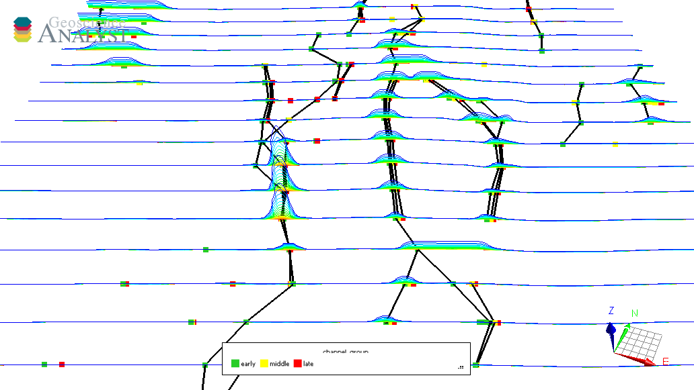
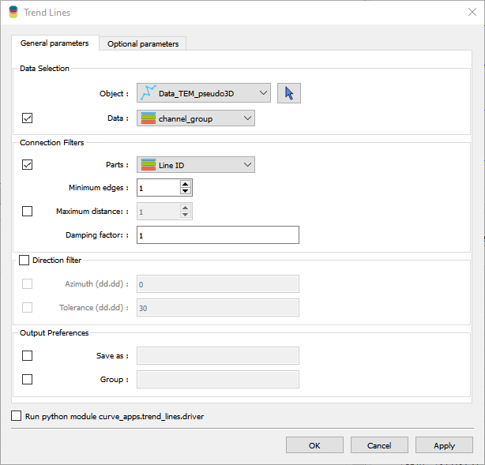

.. _methodology:

Trend Lines
===========

With this application, users can create trend lines from scatter referenced data.

New user? Visit the `Getting Started <getting_started>`_ page.

Application
-----------

The following sections provide details on the different parameters exposed in the user-interface (``trend_lines.ui.json``).

Data Selection
^^^^^^^^^^^^^^

 - **Object**: Select the target ``Points`` or ``Curve`` object from the dropdown list.
 - **Parts**: [Optional] Referenced data defining the unique parts of the object. Connections between vertices belong to the same part are ignored.
 - **Data**: [Optional] Referenced data defining properties to link with segments.

Detection Parameters
^^^^^^^^^^^^^^^^^^^^
 - **Minimum edges**: Minimum number of segments for a trend line to be valid.
 - **Maximum distance**: Maximum distance between two points to consider for trend line detection.
 - **Damping factor**: Threshold parameter [0, 1] penalizing changes in direction between connected segments.
    At 0, the direction change is not penalized, and at 1, the direction change is maximally penalized.

Direction Filter
^^^^^^^^^^^^^^^^
 - **Azimuth**: Filtering of segments orientation based on the azimuth angle.
 - **Tolerance**: Tolerance on deviation of segments orientation from the reference azimuth angle.
